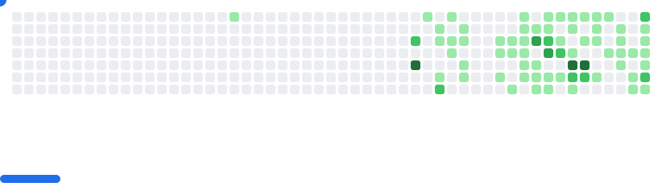

# 👋Hi, I'm **Krishana Yadav**

A dedicated Engineer, Developer, and Creator of impactful technology solutions.
##

<h1 align="center">
  
</h1>

## 💻 Tech Stack & Tools

  <strong>Languages:</strong> 
  

  <strong>Frontend (API Integration):</strong> 
  

  <strong>Backend & APIs:</strong> 
  

  <strong>DevOps & Cloud:</strong> 
  

---

## 📊 GitHub Stats

  
  

---

## 🔧 What I'm Working On
- ✍️ Solving problems on **LeetCode**, **Codeforces**, and **HackerRank**
- 🌐 Building responsive applications with **React** and **Python**
- ⚙️ Building scalable **backend systems** and **REST APIs**  
- 🐳 Improving Docker-based deployment workflows  
- 📊 Practicing DSA for backend interviews

---

## 📫 Connect With Me

  
  
  
  

---

  <picture>
    <source media="(prefers-color-scheme: dark)" srcset="images/breakout-dark.svg" />
    <source media="(prefers-color-scheme: light)" srcset="images/breakout-light.svg" />
    
  </picture>

  

> _"Build something today that your future self will thank you for."_ ✨

